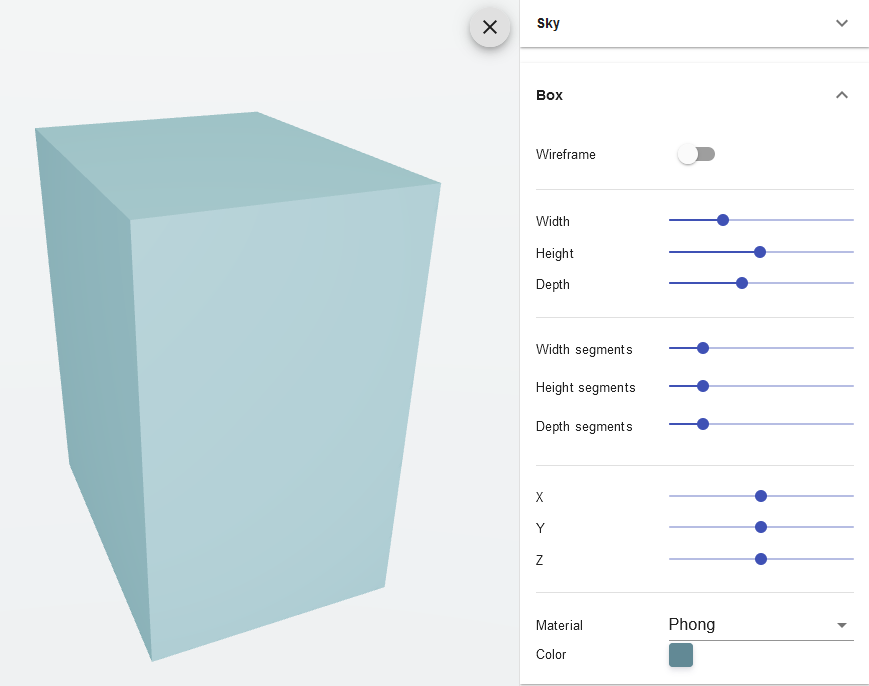

<h1 align="center">r3f-config</h1>
<p align="center">A sandbox config ui tool like dat.GUI for <strong>React Three Fiber </strong></p>
<p align="center">
    <a href="https://www.npmjs.com/package/r3f-config">
        
    </a>
    <a href="https://standardjs.com">
        
    </a>
</p>
<p align="center">
    
</p>

## Install

```bash
yarn add r3f-config
```
```bash
npm install r3f-config
```

## Usage
Doc coming soon, see example for usage

## License
MIT
